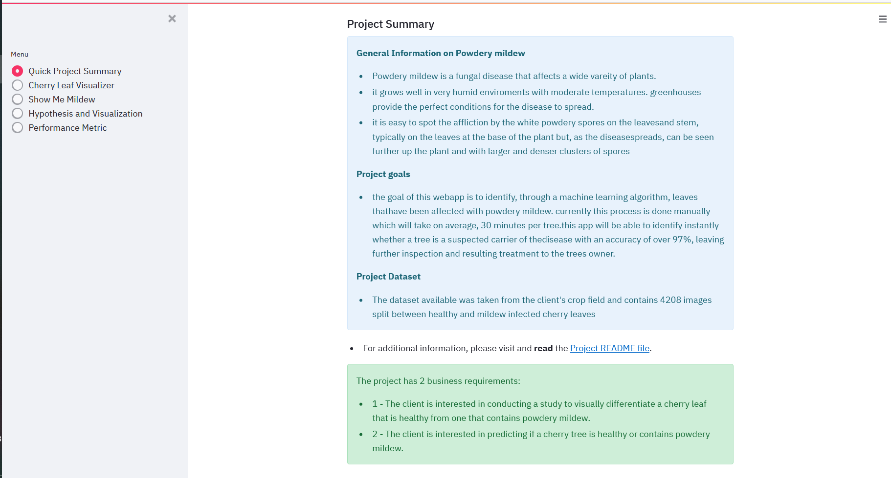
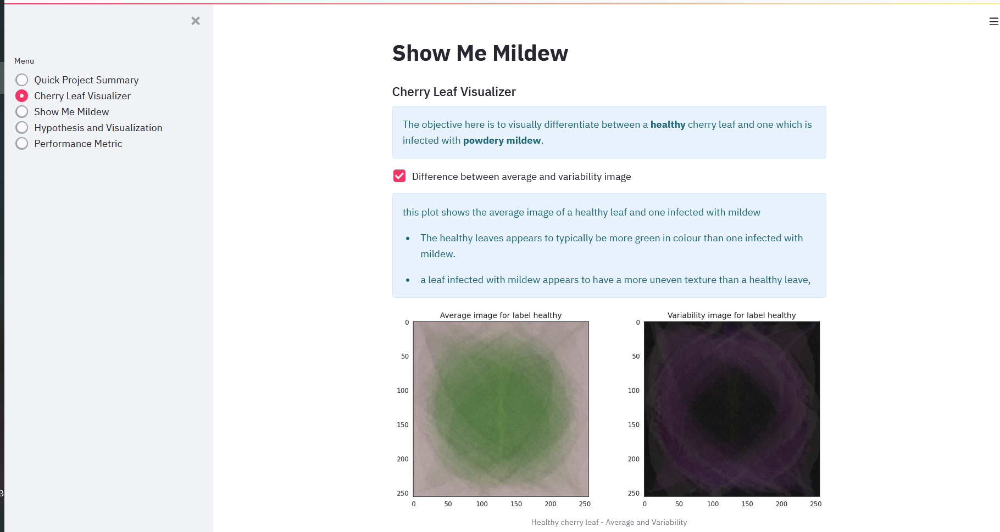
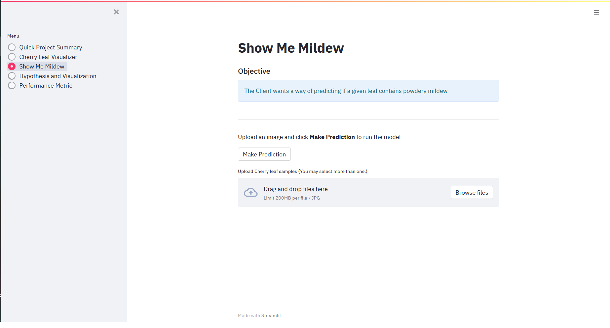
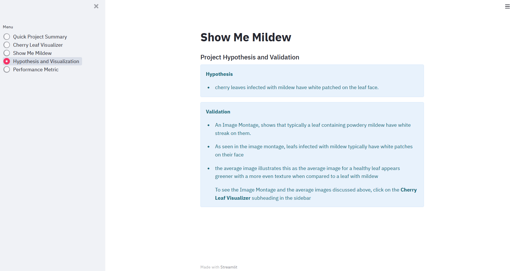
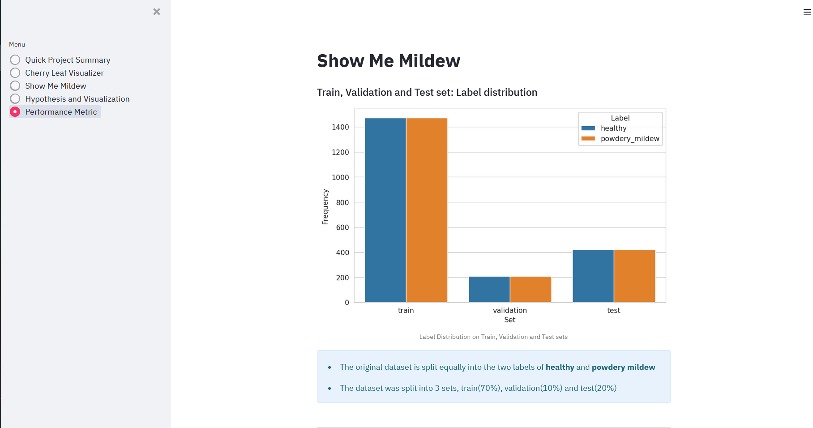

<h1 align=center>Show Me Mildew!</h1>

This website's machine learning technology offers a platform for users to upload photos of cherry leaves and detect whether or not they are healthy or infected with powdery mildew.

this app is a machine learning algorithm that detects from an uploaded image, whether a leaf is infected with powdery mildew
[The live app can be found here]()

# Planning Phase

## Business Requirements

Farmy and foods is a cherry plantation that has found many of their plants have been infected with powdery mildew, a type of fungal diesease that is very harmful to humans. needless to say is important for the company to indentify when a crop has been infected.  

the process is currently done manually, it involes taking a few samples from a given tree and visually inspecting for signs of the diesease. if signs point to the diesaese being present then treatment is given to the infected plant. the process of visually inspecting the tree will take on average 30 minutes, company has over 1000 trees spread accross multiple plantations. 

this app provides a way of identifying an infected plant, with an accuracy of above 97%. an employee from farmy and foods simply needs to upload an image of the samples and the app can tell instantly whether mildew is present.

### **Project Goal:**

* 1 - The client is interested in conducting a study to visually differentiate a cherry leaf that is healthy and that contains powdery mildew.
* 2 - The client is interested to predict if a cherry leaf is healthy or contains powdery mildew.

## Dataset Content
* The dataset was provided by [Kaggle](https://www.kaggle.com/codeinstitute/cherry-leaves). it contains roughly 4000 images split equally between healthy leaves and leaves infected with mildew.

### Sample leaves
---
| 	healthy											         	|											   	 podwery mildew leaf|
| ---													     	| ---															  	|
|| |

## Hypothesis and validation
* leaves presenting signs of powdery mildew show white patched on their face.
* to validate, the conventional method of find the disease will be used.

## User stories

## User stories of business requirements to the data visualizations and machine learning tasks
* **Business Requirement 1**: Data Visualization
	* As a client I want to see the "standard deviation" and "average" images of healthy and infected cherry leaves 
 	* As a client I want to see the how an average healthy cherry leaf and a cherry leaf that has powdery mildew differ.
	* As a client I want to see an image montage of healthy cherry leaves and mildew-infested leaves.

* **Business Requirement 2**:  Classification
	* As a client I want to see if a sameple cherry leaf is healthy or contains powdery mildew so that my products are no harmful to humans

## ML Business Case
* the client wants a machine learning model to assess whether a cherry leaf tree infected or is healthy.
* The ideal outcome is provide Farmy & Foods with a faster and reliable mildew detection mechanism that is readily scalable across the multiple farms in the country
* the aim is to provide Farmy and foods with a way of bypassing lengthy manual testing for detecting mildew than can be used as a standard for mildew detection
* The model success metric are as follows:
	* a model that can assess whether a leaf is healthy or infected with an accuracy of over 97%
    * A study illustrating the difference between a cherry leaf that is healthy from one that contains is infected.

---

## Data Understanding

The image dataset contains 4208 images of cherry leaves, divided equally into two labeled folders, healthy and powdery mildew.

## Data Preparation

The images, rather helpfully, were all of the same size and located in folders that contained only image files. this was verified by scanning the data. in order to create and adequate model, the data was split into sets by the conventional ratio of 70% for training, 20% for testing and 10% for validation

the sample size wasnt sufficent however so image augmentation was used to inflate the dataset. this takes images from the existing sample and alters them by rotating, shearing, zooming etc. this alters them in such as way as to increase the models understanding of what a cherry leaf looks like.

## Modeling

the model was trained on the training dataset and validated using the validation set. the model was then fed the test dataset to test its performance metrics

## Evaluation

The model differentiated between healthy and infected leaves with an accuracy of over 97% which was the the percentage required by the client

---

## Dashboard Design (Streamlit App User Interface)

### Page 1: Quick Project Summary
* A summary page giving a breif description of powdery mildew and the project dataset and outlining the client's requirements.

### Page 2: Cherry leaf visualizer
* this page answers the first business requirement, it shows how to visually tell an infected cherry leaf from a healthy one, the first checkbow shows the average and variability images of the two classifications. the second shows the difference between the two classifications and the third provides and image montage.

### Page 3: Mildew detector
* It will answer the second business requirement, the user can upload an image or a series of images to run the model on. the app will analise the image to see if it detects mildew. the results are presented in a bar chart with the probibility of the classification. the infomation this then summerised in a table that can be downloaded

### Page 4: Project hypothesis and validation
* this page shows the hypothesis and validation

### Page 5: ML performance metrics
* this page displays the model performance

## **Features**
the application had been delivered using streamlit, as easy way of developing simple dashboard apps

**Navigation** The dashboard is a multipage streamlit application, navigation is handled using the sidebar that is visible no matter what page is being veiwed.

- **Page 1: Quick Project Summary**

 
- **Page 2: Cherry leaf visualizer**

- **Page 3: Show me Mildew**

 
- **Page 4: Hypothesis and Visualization**

  
 
- **Page 5: Machine learning performance Metric**

---

## Deployment
what follows are the steps i took to deploy the project to heroku

### Creating Heroku App
The Python version in the project is set to 3.8.13, which is not supported by Heroku's current default stack, heroku-22.
As a result of the above, the app was created from Heroku CLI and set to use buildstack heroku-20.

heroku does not support the the version of python i used (3.8.) so 

Steps take to create the app is as follows:
1. download and install [Heroku CLI](https://devcenter.heroku.com/articles/heroku-cli) if not already installed
2. Copy API key from heroku
	- sign in and click on the avatar icon and select **Account Settings**
	- Scroll down to the API Key section and click **Reveal** button, and copy key displayed.
3. login to Heroku via the console and enter your details when prompted
	`heroku login -i`
	- enter key copied from step 2 when prompted for password
4. create the app
	`heroku apps:create show-me-mildew --stack heroku-20`

### Deploying to Heroku
1. Sign in to Heroku
2. Select app
3. At the Deploy tab, select GitHub as the deployment method.
4. Select your repository name and click Search. Once it is found, click Connect.
5. Select the branch you want to deploy, then click Deploy Branch.
6. The deployment process should happen smoothly in case all deployment files are fully functional. Click now the button Open App on the top of the page to access your App.

## Technologies Used

### Main data analysis and machine learning libraries
* [jupyter notebook](https://jupyter.org) - used to run the machine learning pipelines
* [streamlit](https://streamlit.io/) - used to develop the dashboard
* [pandas](https://pandas.pydata.org/) - used to structuring my data
* [seaborn](https://seaborn.pydata.org/) - used with matplotplib for data visualization
* [matplotlib](https://matplotlib.org/) - used to create charts and plots for data visualization
* [plotly](https://plotly.com/) - used to create charts and plots for data visualization
* [TensorFlow](https://www.tensorflow.org/overview) - used for data preparation to filter out corrupt data. 
* [joblib](https://pypi.org/project/joblib/) for saving and loading image shape
* [numpy](https://numpy.org/) - used to manipulate arrays.
* [Keras](https://keras.io/) - used for the CNN model
* [scikit-learn](https://scikit-learn.org/stable/) - used for data processing

###  Libraries & Programs Used
* [GitHub:](https://github.com/) - used to store the projects code after being pushed from Git.
* [Heroku](https://www.heroku.com/) - Deployment platform for the project
* [GitPod](https://www.gitpod.io/) - Workspace used for the project

## Credits 

data used was from [Kaggle](https://www.kaggle.com/codeinstitute/cherry-leaves)
help with bugs and fixes from [Stack Overflow](https://stackoverflow.com/)

## Acknowledgements
* Thanks very much to Marcel Mulders, my mentor for guiding me through the course and project.
